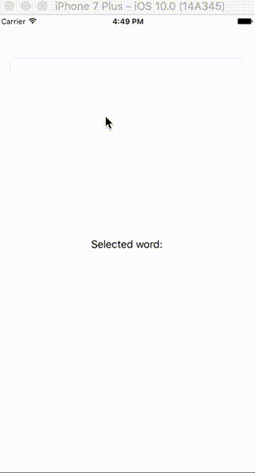

## MultiAutocompleteTextSwift []

TextField can suggest several words like Android's 'MultiAutoCompleteTextView'.
This code is modified from [AutocompleteTextfieldSwift](https://github.com/mnbayan/AutocompleteTextfieldSwift)

<p align="center">
  
</p>

## Install

#### Cocoapods

Add `MultiAutoCompleteTextSwift` to Podfile.

    pod 'MultiAutoCompleteTextSwift'

#### Carthage

Add the `shim0mura/MultiAutoCompleteTextSwift` to Carthfile.

    github "shim0mura/MultiAutoCompleteTextSwift"

## Basic Usage

Import the module.

```swift
import MultiAutoCompleteTextSwift
```

Create a text field and set its class as 'MultiAutoCompleteTextSwift' (on Storyboard).

Set suggest words as "autoCompleteStrings".

```swift

@IBOutlet weak var textField: MultiAutoCompleteTextField!
override func viewDidLoad() {
    super.viewDidLoad()
    let words = [ "ruby", "rust", "mruby", "php", "perl", "python"]
    textField.autoCompleteStrings = words
}
```

## Customize

#### Multi way of suggest

```swift
let token = MultiAutoCompleteToken(top: "C++", subTexts: "cplusplus"),
textField.append(token)
```

If you want to suggest the word that has multi way of reading, Use MultiAutoCompleteToken class.

#### Sepataor
Words punctuated by ',' and whitespace default. You can add other separator by 'autoCompleteWordTokenizers'.

```swift
textField.autoCompleteWordTokenizers([',', ':', ';'])
```

## Version

MultiAutoCompleteTextSwift support swift 3.0. In v0.1.0, MultiAutoCompleteTextSwift support swift 2.3.

## License
MultiAutoCompleteTextSwift is under [MIT license](http://opensource.org/licenses/MIT). See LICENSE for details.
